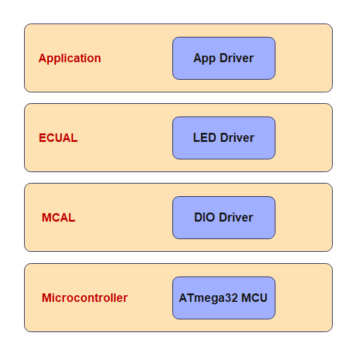

# Chasing LEDs
In this project, 8 LEDs are connected to PORTC of an ATmega32 microcontroller and the microcontroller is operated from an 8 MHz crystal.
The program turns ON the LEDs in an anclockwise manner with 500 ms delay between each output. The net result is that LEDs seem to be chasing each other.

## Project Hardware

## Static Architecture
The project consists of 4 layers:
1. Micrcontroller Layer which represents the ATmega32 microcontroller
2. Microcontroller Absstraction Layer (MCAL) which consists of one driver/module which is the DIO driver
3. Electronic Control Unit Abstraction Layer which consits of one driver/module which is the LED driver
4. Application Layer which contains the application logic

## Usage
There are two options to use the project:
1. Downlaod and install [Microship Studio](https://www.microchip.com/en-us/tools-resources/develop/microchip-studio), adding the project, then build to get the hex file so that you can use it on the simulation or the real target.
2. Download and install [AVR Build Toolchain](https://tinusaur.com/guides/avr-gcc-toolchain/) and build the project using the avr-gcc compiler or using makefile

## Further Development
The project can be modified such that the LEDs chase each other in both directions. For
example, while moving in an anticlockwise direction, when LED 8 is ON, the direction
can be changed so that the next LED to turn ON is LED 7, LED 6, and so on.

## License
[MIT](https://choosealicense.com/licenses/mit/)
