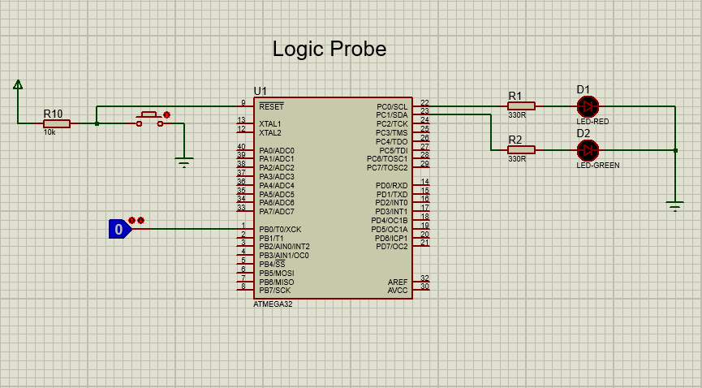
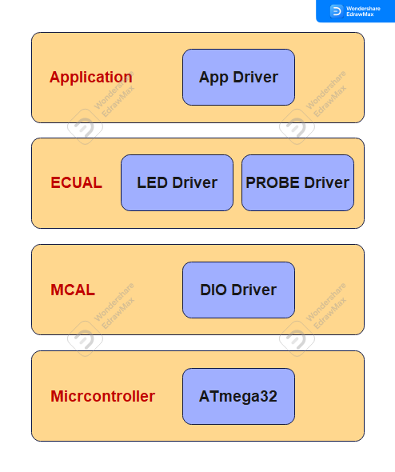
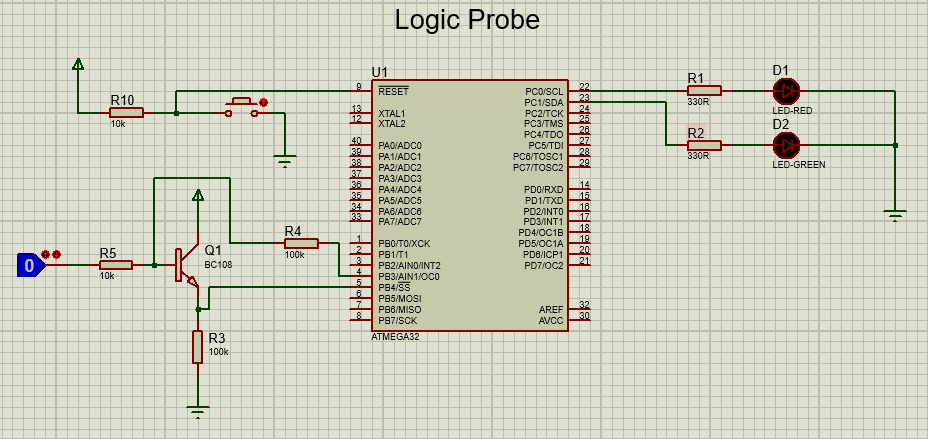

# LED Dice
This project is a simple logic probe. A logic probe is used to indicate the logic status of an
unknown digital signal. In a typical application, a test lead (probe) is used to detect the
unknown signal, and two different color LEDs are used to indicate the logic status. If, for
example, the signal is logic 0, then the RED color LED is turned ON. If on the other hand
the signal is logic 1, then the GREEN LED is turned ON.

## Project Hardware
Port pin PB0 is used as the probe input. Port pins PC0 and PC1 are connected to RED LED and GREEN LED, respectively.

## Static Architecture
The project consists of 4 layers:
1. Micrcontroller Layer which represents the ATmega32 microcontroller
2. Microcontroller Abstraction Layer (MCAL) which consists of one driver/module which is the DIO driver
3. Electronic Control Unit Abstraction Layer (ECUAL) which consists of two modules/drivers: LED and PROBE drivers
4. Application Layer which contains the application logic

## Usage
There are two options to use the project:
1. Downlaod and install [Microship Studio](https://www.microchip.com/en-us/tools-resources/develop/microchip-studio), adding the project, then build to get the hex file so that you can use it on the simulation or the real target.
2. Download and install [AVR Build Toolchain](https://tinusaur.com/guides/avr-gcc-toolchain/) and build the project using the avr-gcc compiler or using makefile

## Further Development

The problem with this logic probe is that one of the LEDs is always ON even if the probe
is not connected to any digital signal, or if the signal is at high-impedance state (i.e.
tristate). We can develop the project further so that the high-impedance state can also be
detected, and none of the LEDs are turned ON.

The following picture shows the modified circuit diagram. Note here that a transistor (BC108) is
used at the front end of the circuit. The operation of the circuit is as follows.

The transistor is configured as an emitter follower stage with the base controlled from
output pin PB3 of the microcontroller through a 100-K resistor. The external signal is also
applied to the base of the transistor through a 10-K resistor. The emitter of the transistor is
connected to input pin PB4 of the microcontroller through a 100-K resistor. Pin PB3
applies logic levels to the base of the transistor, and then pin P43 determines the state of
the external signal (probe) as shown in the following table. For example, if after setting PB3 = 1,
we detect PB4 = 1 and also after setting PB3 = 0 we again detect PB4 = 1 then the probe
must be at logic 1.

<table>
	<tr>
		<th>Probe State</th>
		<th>Applied to PB3</th>
		<th>Detected at PB4</th>
	</tr>
	<tr>
		<td>Probe at high impedance</td>
		<td>1</td>
		<td>1</td>
	</tr>
	<tr>
		<td>Probe at high impedance</td>
		<td>0</td>
		<td>0</td>
	</tr>
		<tr>
		<td>Probe at logic 1</td>
		<td>1</td>
		<td>1</td>
	</tr>
	<tr>
		<td>Probe at logic 1</td>
		<td>0</td>
		<td>1</td>
	</tr>
		<tr>
		<td>Probe at logic 0</td>
		<td>1</td>
		<td>0</td>
	</tr>
	<tr>
		<td>Probe at logic 0</td>
		<td>0</td>
		<td>0</td>
	</tr>
</table>

## License
[MIT](https://choosealicense.com/licenses/mit/)
