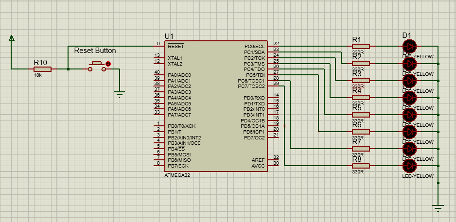

# Chasing LEDs
In this project, eight LEDs are connected to PORTC of a ATmega32-type
microcontroller, and the microcontroller is operated from an 8-MHz crystal. An integer
random number is generated between 1 and 255 every second, and the LEDs are turned
ON to indicate this number in binary. The net result is that the LEDs flash in a random
fashion, and it is interesting to watch them flashing.

## Project Hardware

## Static Architecture
The project consists of 3 layers:
1. Micrcontroller Layer which represents the ATmega32 microcontroller
2. Microcontroller Abstraction Layer (MCAL) which consists of one driver/module which is the DIO driver
3. Application Layer which contains the application logic

## Usage
There are two options to use the project:
1. Downlaod and install [Microship Studio](https://www.microchip.com/en-us/tools-resources/develop/microchip-studio), adding the project, then build to get the hex file so that you can use it on the simulation or the real target.
2. Download and install [AVR Build Toolchain](https://tinusaur.com/guides/avr-gcc-toolchain/) and build the project using the avr-gcc compiler or using makefile

## License
[MIT](https://choosealicense.com/licenses/mit/)
