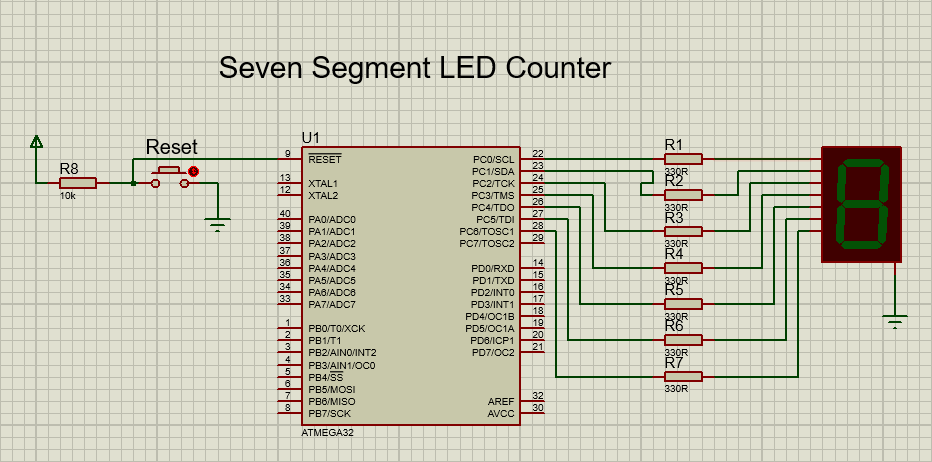
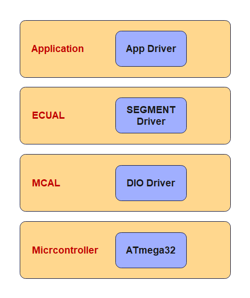

# Seven Segment LED Counter
In this project a common cathode 7-segment LED display is connected to PORTC of a ATmega32
microcontroller and the microcontroller is operated from an 8 MHz crystal. The program displays
numbers 0 to 9 on the display with a 500 ms delay between each output.

## Project Hardware

## Static Architecture
The project consists of 4 layers:
1. Micrcontroller Layer which represents the ATmega32 microcontroller
2. Microcontroller Abstraction Layer (MCAL) which consists of one driver/module: the DIO driver
3. Electronic Control Unit Abstraction Layer which consits of one driver/module: The Seven segment driver
4. Application Layer which contains the application logic

## Usage
There are two options to use the project:
1. Downlaod and install [Microship Studio](https://www.microchip.com/en-us/tools-resources/develop/microchip-studio), adding the project, then build to get the hex file so that you can use it on the simulation or the real target.
2. Download and install [AVR Build Toolchain](https://tinusaur.com/guides/avr-gcc-toolchain/) and build the project using the avr-gcc compiler or using makefile

## License
[MIT](https://choosealicense.com/licenses/mit/)
