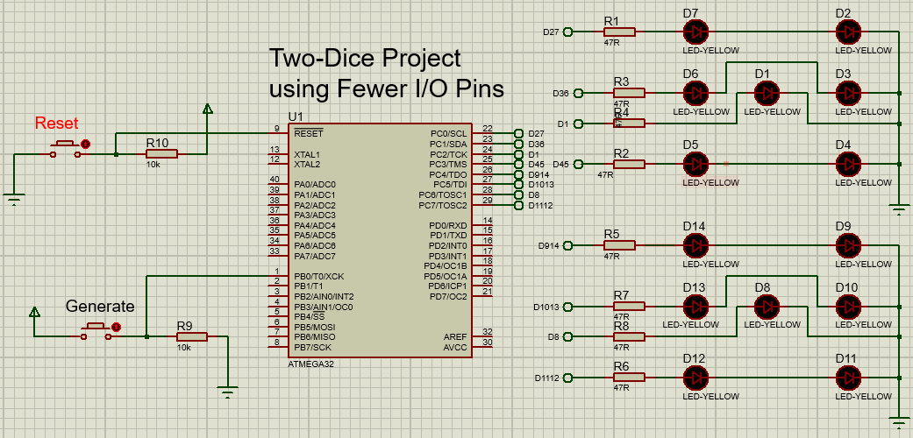
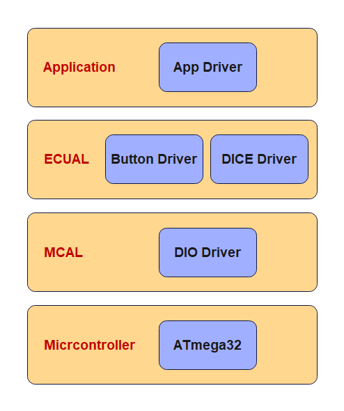

# Two-Dice Project Using Fewer I/O Pins

In this project 7 LEDs are connected to PORTC of a ATmega32 microcontroller and 7 LEDs to
PORTD. The microcontroller is operated from an 8 MHz crystal. The LEDs are organized as the
faces of a real dice. When a push-button switch connected to PB0 is pressed a dice pattern is
displayed on the LEDs. The display remains in this state for 500 ms and after this period the
LEDs all turn OFF to indicate that the system is ready for the button to be pressed again.

This project is similar to Project <a href="../Two-Dice Project">Two-Dice Project</a>, but here, LEDs are shared, which uses fewer input/
output pins. By looking to the following table and the project circuit, you can notice that: 
<table>
	<tr>
		<th>Required Number</th>
		<th>LEDs to be turned on</th>
	</tr>
	<tr>
		<td>1</td>
		<td>D1</td>
	</tr>
	<tr>
		<td>2</td>
		<td>D3, D6</td>
	</tr>
	<tr>
		<td>3</td>
		<td>D1, D3, D6</td>
	</tr>
	<tr>
		<td>4</td>
		<td>D2, D4, D5, D7</td>
	</tr>
	<tr>
		<td>5</td>
		<td>D1, D2, D4, D5, D7</td>
	</tr>
	<tr>
		<td>6</td>
		<td>D2, D3, D4, D5, D6, D7</td>
	</tr>

</table>

<ol>
	<li>D1 can appear on its own</li>
	<li>D2 and D7 are always together</li>
	<li>D3 and D6 are always together</li>
	<li>D4 and D5 are always together</li>
</ol> 

Thus, we can drive D1 on its own, and then drive the D2, D7 pair together in series, D3, D7 pair together in series, and also D4, D5 pair together in series. Altogether four lines will be required to drive seven LEDs of a dice. Similarly, four lines will be required to drive the second dice. Thus, a pair of dice can easily be driven from an 8-bit output port.

## Project Hardware

The circuit diagram of the project is shown in the following circuit. PORTC of a ATmega32
microcontroller is used to drive the LEDs as follows:
<ul>
	<li>PC0 drives D2, D7 of the first dice</li>
	<li>PC1 drives D3, D6 of the first dice</li>
	<li>PC2 drives D1 of the first dice</li>
	<li>PC3 drives D4, D5 of the first dice</li>
	<li>PC4 drives D9, D14 of the second dice</li>
	<li>PC5 drives D10, D13 of the second dice</li>
	<li>PC6 drives D8 of the second dice</li>
	<li>PC7 drives D11, D12 of the second dice</li>
</ul>

Since we are driving two LEDs on some outputs, we can calculate the required value of
the current limiting resistors. Assuming that the voltage drop across each yellow LED is 2 V, the
current through the LED is 20 mA, and the output high voltage of the microcontroller is
5.00 V, the required resistors are 50 Ohm using Ohm's law.

## Static Architecture
The project consists of 4 layers:
1. Micrcontroller Layer which represents the ATmega32 microcontroller
2. Microcontroller Abstraction Layer (MCAL) which consists of one driver/module: the DIO driver
3. Electronic Control Unit Abstraction Layer which consits of two drivers/modules The BUTTON and DICE drivers
4. Application Layer which contains the application logic

## Usage
There are two options to use the project:
1. Downlaod and install [Microship Studio](https://www.microchip.com/en-us/tools-resources/develop/microchip-studio), adding the project, then build to get the hex file so that you can use it on the simulation or the real target.
2. Download and install [AVR Build Toolchain](https://tinusaur.com/guides/avr-gcc-toolchain/) and build the project using the avr-gcc compiler or using makefile

## License
[MIT](https://choosealicense.com/licenses/mit/)
